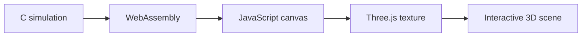

# Emergent Systems Simulator

**An interactive C, WebAssembly, and Three.js project exploring cellular automata, reaction–diffusion, procedural structures, and agent-based movement.**


[Watch the final simulation](reflections/final_scene.mp4)

## Overview

Emergent Systems Simulator is a browser-based university project that connects low-level C simulations with an interactive Three.js environment. The final scene is a Star Wars-inspired simulation in which a squadron of X-wings uses boid behaviours to approach an orbiting Death Star while a Gray–Scott reaction–diffusion system generates the animated surface of the surrounding planet.

The project explores how relatively simple local rules—cellular automata, chemical diffusion, recursive generation, and steering forces—can combine to produce complex visual behaviour.

## Key Features

- Conway's Game of Life running in C and compiled to WebAssembly.
- Interactive OR and XOR drawing tools with a larger brush and preset lifeforms.
- Gray–Scott reaction–diffusion with adjustable feed, kill, diffusion, and time-step values.
- A live simulation canvas used as a texture inside a Three.js scene.
- A procedurally generated spiral galaxy built from recursive star clusters.
- Matrix-based orbital movement for the Death Star.
- A squadron using separation, alignment, cohesion, target seeking, and obstacle avoidance.
- GLTF X-wing models, laser effects, and a timed particle explosion.
- Mouse-look and WASD camera controls for exploring the scene.

## System Flow



The C code owns and updates the cellular grid. Emscripten compiles that code to WebAssembly, allowing JavaScript to read the simulation state and convert it into canvas pixel data. Three.js then uses the canvas as a live texture while a separate render loop updates the orbit, squadron movement, lasers, camera, and explosion effects.

## My Contribution

This project began from a teaching scaffold rather than an empty repository. My work included:

- Completing the missing C/WebAssembly width, height, cell-access, and bounds-checking functions.
- Adding pause, resume, restart, OR, and XOR controls to the Conway interface.
- Implementing a 5×5 drawing brush and adding pond and spaceship patterns.
- Completing the missing reaction–diffusion interface functions and correcting the time-step setter.
- Extending the basic Three.js canvas-texture example into the final Star Wars-inspired scene.
- Building the planet, Death Star, recursive galaxy, orbital movement, camera controls, collision avoidance, laser system, and explosion sequence.
- Adapting course boid rules into a squadron that seeks a moving target while maintaining separation, alignment, and cohesion.
- Integrating and cloning a GLTF X-wing model across the squadron.

## Technologies

- **Languages:** C, JavaScript, HTML, CSS
- **Graphics:** Three.js, WebGL, Canvas API, GLTF
- **Systems:** WebAssembly, Emscripten
- **Tooling:** Vite, Bun, Git

## Running the Project

### Prerequisites

- [Bun](https://bun.sh/) or another compatible JavaScript package manager
- [Emscripten](https://emscripten.org/) for compiling the C simulations

### Installation

Clone the repository and install its dependencies:

```bash
git clone https://github.com/Codeedup/Emergent-systems-simulator.git
cd Emergent-systems-simulator
bun install
```

Compile the Conway simulation:

```bash
emcc conway/conway_web.c -o conway/conway_web.js \
  -s EXPORTED_RUNTIME_METHODS='["ccall","cwrap"]' \
  -s MODULARIZE=1 \
  -s EXPORT_ES6=1 \
  -s ALLOW_MEMORY_GROWTH=1
```

Compile the Gray–Scott simulation:

```bash
emcc rd/rd_web.c -o rd/rd_web.js \
  -s EXPORTED_RUNTIME_METHODS='["ccall","cwrap"]' \
  -s MODULARIZE=1 \
  -s EXPORT_ES6=1 \
  -s ALLOW_MEMORY_GROWTH=1
```

Start the Vite development server:

```bash
bun run dev
```

Open the local address displayed by Vite. The landing page links to the Conway, reaction–diffusion, and final Three.js demonstrations.

## Project Structure

| Path | Purpose |
|---|---|
| `conway/` | Conway C source and browser interface |
| `rd/` | Gray–Scott C source and browser interface |
| `canvas_texture/` | Final Three.js simulation and 3D assets |
| `reflections/` | Development screenshots, recordings, and process notes |
| `src/` | Shared Vite assets and styling |

## Origin and Attribution

The starter repository was created by **Evan Raskob** for the UAL Methods 2: Digital Systems unit. It provided the Vite and Three.js setup, the core Conway and Gray–Scott implementations, and a basic example that displayed a WebAssembly canvas texture on a Three.js object.

The boid neighbour rules and GLTF-loading approach were adapted from course examples. The spiral-galaxy structure was developed with conceptual assistance from ChatGPT and then implemented and integrated into this project.

The X-wing model is a third-party asset. **Its original source and licence must be added here before the repository is presented as complete.**

This is an educational fan project and is not affiliated with or endorsed by Lucasfilm or Disney.

## Current Limitations

- WebAssembly build files currently need to be generated manually with Emscripten.
- The reaction–diffusion update pauses after approximately 12 seconds to control rendering cost.
- Some movement values are frame-dependent rather than fully time-step independent.
- The simulation is a visual prototype rather than a complete game.
